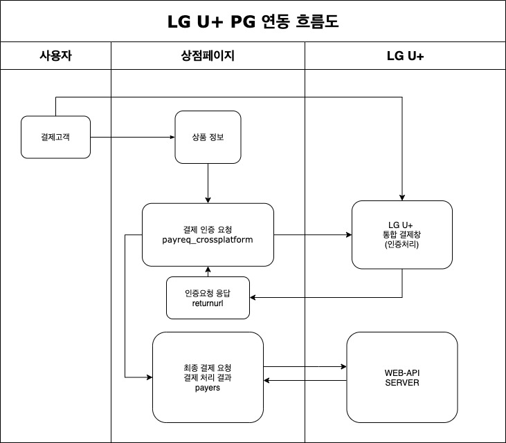

## 본 페이지는 LG U+ PG 연동 방법을 소개한다.

> PHP 7.x 샘플 기준으로 정리한 내용

#### [ XPay 샘플 소개 ]


###### [ 샘플 디렉토리 구조 ]

```bash
.
├── Cancel.html
├── Cancel.php
├── CashReceipt.html
├── CashReceipt.php
├── PHP7_README.txt
├── cas_noteurl.php
├── lgdacom
│  ├── JSON.php
│  ├── XPayClient.php
│  ├── conf
│  │  ├── ca-bundle.crt
│  │  ├── lgdacom.conf
│  │  └── mall.conf
│  ├── patch.php
│  └── ping.php
├── logs
│  └── log_20200515.log
├── payreq_crossplatform.php
├── payres.php
├── returnurl.php
└── sample_crossplatform.html
```

###### [ PHP 파일 설명 ]

| 파일명                     | 설명                                              | 작업구분 |
| -------------------------- | ------------------------------------------------- | -------- |
| Cancel.html                | 전자결제 취소요청을 위한 정보 입력 페이지         | 개발필요 |
| Cancel.php                 | 취소요청 페이지                                   | 개발필요 |
| CashReceipt.html           | 현금영수증 발급/취소를 위한 정보 입력 페이지      | 개발필요 |
| CashReceipt.php            | 현금영수증 발급/최소를 위한 처리 요청 페이지      | 개발필요 |
| cas_noteurl.php            | 무통장(가상계좌) 할당, 입금 통보 결과 처리 페이지 | 개발필요 |
| lgdacom/JSON.php           | JSON 변환 클래스                                  | 수정불가 |
| lgdacom/XPayclient.php     | API 클래스                                        | 수정불가 |
| lgdacom/conf/ca-bundle.crt | SSL 인증서                                        | 수정불가 |
| lgdacom/conf/lgdacom.conf  | LG U+환경설정 파일                                | 수정불가 |
| lgdacom/conf/mall.conf     | 상점용 환경 설정 파일                             | 변경필요 |
| lgdacom/patch.php          |                                                   |          |
| lgdacom/ping.php           |                                                   |          |
| sample_crossplatform.html  | 결제를 위한 데이터 입력 페이지                    | 개발필요 |
| payreq_crossplatform.php   | 인증결제창호출및요청페이지                        | 개발필요 |
| returnurl.php              | 인증결과수신및전달페이지                          | 개발필요 |

###### [ 설정파일 설명 : lgdacom.conf ]

| 파라미터 | 설명                           | 작업구분 |
| -------- | ------------------------------ | -------- |
| url      | API 결제 요청 WEB URL (서비스) | 수정불가 |
| test_url | API 결제 요청 WEB URL (테스트) | 수정불가 |

###### [ 설정파일 설명 : mall.conf ]

| 파라미터                 | 설명                                                         | 작업구분 |
| ------------------------ | ------------------------------------------------------------ | -------- |
| server_id                | 다수의 mall.conf가 하나의 로그 디렉토리를 바라볼 때, 각 상점서버에서 발생된 XPayClient에 대한 로그를 구분하기 위한 구분자. |          |
| timeout                  | XPayClient 요청 시 Timeout 시간 (단위:초), 설정된 시간 초과시 Timeout 발생 |          |
| log_dir                  | XPayClient에 대한 로그를 쌓기 위한 디렉토리 지정(Full Path)  |          |
| log_level                | 로그를 남기는 기준. DEBUG 일 경우 모든 로그를 표시, 그 외의 레벨은 심각한 에러일 경우에만 표시3: INFO4: DEBUG |          |
| verity_cert              | SSL 인증 유효성 체크, 상점 서버에서 LG U+ 인증서 오류 발생시 “0”으로 설정0: 인증서 검증하지 않음1: 인증서 검증 |          |
| verify_host              | SSL 도메인 인증(도메인 확인)0: 확인하지 않음 (test시만 사용)1: 인증서 내의 domain name 확인 |          |
| report_error             | 사용하지 않음에러 발생시 LG U+ 로 리포트 전송 여부0: 전송하지 않음(error 관련 내용만 전송)1: error시 report전송 |          |
| auto_rollback            | XPayClient 결제 요청 후 timeout에 설정된 시간이 초과될 시 롤백 수행 여부0 자동취소 사용안함1: 자동취소 사용 |          |
| output_UTF8              | LG U+ 서버의 디폴트 인코딩은 EUC-KR0: EUC-KR로 리턴1: 서버 응답을 UTF-8로 리턴 |          |
| default_secure_protocols | TLS 통신을 위한 설정512((TLS1.1), 2048(TLS1.2), 2560(TLS1.3),3072(.NET용 TLS1.2) |          |
| keystore_cacerts_dir     | JSP용 인증서 키스토어 위치 설정                              |          |
| 테스트 상점아이디        | 테스트용 상점아이디와 Mert Key를 등록                        |          |
| 서비스 상점아이디        | 서비스용 상점아이디와 Mert Key를 등록                        |          |


###### [ 주의 및 확인 정보 ]

- lgdacom 및 로그 데이터의 위치는 외부 접근이 안되는 곳에 위치 시켜야 한다.
- 상점 아이디와 MertKey가 노출 될 경우 부정 거래 발생 위험이 있다.
- **mall.conf** 에는 상점 아이디와 **Mertkey**가 설정되어야 한다.

> 상점아이디 및 Mertkey 설정 에
>
> 상점아이디 = MertKey
>
> **tlgdacomxpay = 95160cce09854ef44d2edb2bfb05f9f3**
>
> **lgdacomxpay = 95160cce09854ef44d2edb2bfb05f9f3**
>
> MertKey는상점관리자의 “상점정보관리“ 메뉴에서확인이가능합니다.
>
> 테스트상점정보관리: http://pgweb.uplus.co.kr/tmert
>
> 서비스상점정보관리: http://pgweb.uplus.co.kr
>
> 상점관리자 > 계약정보> 상점정보관리의시스템연동정보탭> Mertkey확인


###### [ 연동 흐름도 ]



1. 결제인증 요청 정보 (상품명, 금액…)

2. 결제 인증 요청

3. LG U+ 통합 결제창 인증처리 (사용자 결제 정보 입력)

4. returnurl로 LGD_PAYKEY 전달 -> payreq_crossplatform 에 LGD_PAYKEY 설정

5. payreq_crossplatform 에 결제 인증결과를 payres로 요청

6. payres 에서 LG U+ API Server로 최종 결제 요청

7. LG U+ API Server에서  요청 결과 전달


#### [ XPay 결제를 위한 개발 사항 ]

- 환경설정 파일 위치 지정 및 **mall.cof 에 상점아이디, Mertkey 설정**
  - 환경설정 파일의 위치를 지정하지 않을 시 API 초기화 실패 발생
  - **서비스 페이지 마다 $configPath 를 지정해야 한다.**

```php
$configPath = $_SERVER["DOCUMENT_ROOT"] .'/lgdacom';
```

- 서비스 플랫폼 및 상점 아이디, MertKey 설정
  - 테스트용과 서비스용을 모두 설정해야 한다.
  - **서비스 아이디가 LGUPLUS 일 경우 테스트 아니디는 tLGUPLUS 가 된다.**

```bash
// mall.conf
tlgdacomxpay = 95160cce09854ef44d2edb2bfb05f9f3
lgdacomxpay = 95160cce09854ef44d2edb2bfb05f9f3
```

- 파라미터

```php
// payreq_crossplatform.php

// 파라미터 CST_PLATFORM(서비스 플랫폼)에 test 또는 service 값을 설정
$CST_PLATFORM = $_POST["CST_PLATFORM"];

// 파라미터 CST_MID에 발급 받은 상점 아이디를 설정
$CST_MID = $_POST ["CST_MID"];

// 파라미터 CST_PLATFORM에 따라 실제 연동에 쓰이는 상점아이디를 LGD_MID에 자동으로 할당
$LGD_MID = (("test" == $CST_PLATFORM)?"t":"").$CST_MID;
```

- [인증 결제창 호출](#step1)

```javascript
// LG U+의 xpay_crossplatform.js를 링크

<!-- test일 경우 -->
<script language="javascript" src="https://pretest.uplus.co.kr:9443/xpay/js/xpay_crossplatform.js" type="text/javascript"></script>

<!-- service일 경우 아래 URL을 사용
<script language="javascript" src="https://xpayvvip.uplus.co.kr/xpay/js/xpay_crossplatform.js" type="text/javascript"></script>
-->

// 인증결제창을 호출하는 함수: openXpay
function launchCrossPlatform(){
  //① 결제창 객체 저장
	lgdwin = openXpay(document.getElementById('LGD_PAYINFO'), ‘<?= CST_PLATFORM ?>', ‘<?= LGD_WINDOW_TYPE ?>', null, "", "");

}
```

- **테스트와 서비스의 xpay_crossplatform.js 의 링크 주소가 다르므로** CST_PLATFORM의 설정에 따라 다르게 동작하도록 할 필요가 있다.

  > lgdwin = openXpay(document.getElementById('LGD_PAYINFO'), '<?= $CST_PLATFORM ?>', LGD_window_type, null, "", "");
  >
  > 
  >
  > 1. LGD_PAYINFO : 아래 Xpay 결제창 호출 요청 파라미터를 전송한다 ( [**XPay 결제 서비스 파라미터 참조**](#-xpay-결제-서비스-파라미터-) )
  >
  > 2. CST_PLATFORM : “service” or “test"
  >
  > 3. LGD_WINDOW_TYPE : "iframe"

- **참고:**

  - 인증이 완료된 이후, 인증결과인 응답코드, 응답메시지, 인증키, 인증타입을 lgdwin의 contentWindow 또는 ontentDocument 형태로 저장한다.
  - 해당 파라미터에 대한 설명은 “5.2. XPay 결제 서비스 파라미터”의 “XPay 인증 결제요청 결과 리턴 파라미터”를 참조한다.
  - 데이터 흐름에 대한 설명은 “4. XPay 연동 샘플파일 안내”의 “샘플 페이지 개요”를 참조한다.

- 최종결제 요청에 필요한 데이터를 리턴 받는 **returnurl 페이지의 URL을 payreq_crossplatform 페이지에서 반드시 설정**해 주어야 한다.

- XPay 서버스 이용 시 많은 개인정보 및 인증정보가 유통되고 있어 암호화 통신을 하지 않을 경우 정보가 외부로 유출 될 수 있으므로 암호화 통신을 위하여 HTTPS 프로토콜을 필수로 적용해야 합니다.

```php
// 반드시 현재 페이지와 동일한 프로트콜 및 호스트이어야 합니다
$LGD_RETURNURL = "https://www.customurl.org/returnurl.php";
```

- 결제정보 검증 전달 데이터 전달
  1. openXpay 를 호출 할 때 lgdwin 변수에 결제창의 객체 저장

  2. payreq_crossplatform에서 정의되었던 returnurl 호출

  3. returnurl에서 부모 페이지(payreq_crossplatform)의 “payment_return” 함수 호출

  4. payreq_crossplatform 의 “payment_return” 함수에서 LGD_PAYKEY 엘리먼트에 값 할당

  5. “payment_return”에서 payres에 데이터 전달

```javascript
// returnurl page

<script type="text/javascript">

  function setLGDResult() {

   // ③ returnurl에서 부모 페이지(payreq_crossplatform)의 “payment_return” 호출
   parent.payment_return();

   try {
   } catch (e) {
     alert(e.message);
   }
  }
  
</script>

<body onload="setLGDResult()”>
```

- **절차 ”④”, “⑤”**: 절차 ”①”의 변수 “lgdwin”에 저장된 데이터를 바탕으로 응답코드(LGD_RESPCODE)가 성공(“0000”)일 때 LGD_PAYKEY 엘리먼트에 값을 할당합니다. 할당된 LGD_PAYKEY는 최종 결제 요청을 위해 payreq_crossplatform의 데이터와 함께 전달됩니다.

```javascript
// parent page ( payreq_crossplatform.php )

<script type="text/javascript">

// returnurl에서 payreq_crossplatform의 payment_return() 함수 호출, payres로 본인확인 결과 데이터 전달

function payment_return() {

  var fDoc = lgdwin.contentWindow || lgdwin.contentDocument;

  if (fDoc.document.getElementById('LGD_RESPCODE').value == "0000") {

    // 결제정보 검증 성공일 시 payres 페이지로 데이터 전달
    // ④ payreq_crossplatform의 “payment_return” 함수에서 LGD_PAYKEY 엘리먼트에 값 할당
    document.getElementById("LGD_PAYKEY").value = fDoc.document.getElementById('LGD_PAYKEY').value;

    // ⑤ “payment_return”에서 payres에 데이터 전달
    document.getElementById("LGD_PAYINFO").target = "_self";
    document.getElementById("LGD_PAYINFO").action = "payres.php";
    document.getElementById("LGD_PAYINFO").submit();

  } else {

    // 결제정보 검증 실패일 시
    alert("LGD_RESPCODE (결과코드) : " + fDoc.document.getElementById('LGD_RESPCODE').value + "\n" + "LGD_RESPMSG (결과메시지): " + fDoc.document.getElementById('LGD_RESPMSG').value);

    closeIframe();

  }

}

</script>
```

- **최종 결제 요청 및 요청 결과 처리**

  1. XPay의 최종 결제 요청은 인증결제창에서 입력된 데이터의 검증이 완료된 후 [payres](#payres) 페이지에서 진행된다. 이 단계의 진행 절차는 다음과 같다.

  2. XPayClient 사용을 위한 객체 생성

  3. XPayClient 초기화(환경설정 파일 로드)

  4. 메모리에 mall.conf, lgdacom.conf 할당 및 트랜잭션의 고유한 키 TXID 생성

  5. lgdacom.conf에 설정된 URL로 소켓 통신하여 최종 결제요청, 결과값으로 true 또는 false 리턴

  6. DB에 결제요청 결과 처리

  

#step1

###### [ XPay 결제 서비스 파라미터 ]

> 인증결제창 호출 요청 파라미터
>
> openXpay() 함수 호출 시 LGD_PAYINFO 에 담길 파라미터 정보

**공통부분**

| **파라미터명**                | **설명**                                                     | **최대길이(byte)** |
| ----------------------------- | ------------------------------------------------------------ | ------------------ |
| **CST_PLATFORM\***            | service 또는 test                                            |                    |
| **CST_MID\***                 | LG U+와 계약시 설정한 상점아이디                             |                    |
| **LGD_MID\***                 | LG U+와 계약시 설정한 상점아이디                             | 15                 |
| **LGD_OID\***                 | 주문번호· 상점아이디별로 유일한 값을(유니크하게) 상점에서 생성☞ 영문,숫자, -, _ 만 사용가능(한글금지), 최대 63자 | 64                 |
| **LGD_AMOUNT\***              | 결제금액   ☞ "," 가 없는 형태 (예 : 23400)                   | 12                 |
| **LGD_BUYER\***               | 구매자명                                                     | 30                 |
| **LGD_PRODUCTINFO\***         | 구매내역                                                     | 192                |
| **LGD_TIMESTAMP\***           | 타임스탬프(현재시간을 넘겨주세요)· 거래 위변조를 막기위해 사용· 숫자형식으로만 전달, 예) 20090226110637 | 14                 |
| **LGD_HASHDATA\***            | 해쉬데이타 · 거래 위변조를 막기 위한 파라미터 ☞ 샘플페이지 참조(자동생성) |                    |
| **LGD_RETURNURL\***           | 인증결과 응답수신페이지 URL                                  |                    |
| **LGD_WINDOW_TYPE\***         | 결제창 호출 방식· iframe                                     |                    |
| **LGD_BUYERID\***             | 구매자아이디☞ 상품권결제시 필수                              | 30                 |
| **LGD_BUYERIP\***             | 구매자아이피☞ 상품권결제시 필수                              |                    |
| **LGD_BUYERADDRESS**          | 구매자주소                                                   | 128                |
| **LGD_BUYERPHONE**            | 구매자휴대폰번호                                             | 15                 |
| **LGD_BUYEREMAIL**            | 구매자이메일 · 결제성공시 해당 이메일로 결제내역 전송        | 40                 |
| **LGD_PRODUCTCODE**           | 상품코드                                                     | 40                 |
| **LGD_RECEIVER**              | 수취인                                                       | 10                 |
| **LGD_RECEIVERPHONE**         | 수취인전화번호                                               | 15                 |
| **LGD_DELIVERYINFO**          | 배송정보                                                     | 128                |
| **LGD_CUSTOM_PROCESSTYPE\***  | 상점정의 프로세스 타입  (기본값 : TWOTR)                     |                    |
| **LGD_CUSTOM_SESSIONTIMEOUT** | 상점정의 세션유지 가능시간 (기본값 : 20분)                   |                    |
| **LGD_CUSTOM_USABLEPAY**      | 상점정의 결제 가능 수단· 특정 결제수단만 보이게 할 경우 사용 예) 신용카드, 계좌이체만 사용할 경우SC0010-SC0030 |                    |
| **LGD_CUSTOM_SKIN**           | 상점정의 스킨 (기본값 : red)                                 |                    |
| **LGD_CUSTOM_CEONAME**        | 상점정의 대표자명                                            |                    |
| **LGD_CUSTOM_MERTNAME**       | 상점정의 상점명                                              |                    |
| **LGD_CUSTOM_MERTPHONE**      | 상점정의 상점전화번호                                        |                    |
| **LGD_CUSTOM_BUSINESSNUM**    | 상점정의 사업자번호                                          |                    |
| **LGD_CUSTOM_LOGO**           | 상점정의 로고 이미지 URL (로고 설정)· 높이21pix * (폭은 결제창 사이즈에 맞게 정의) |                    |
| **LGD_CUSTOM_CARDPOINTUSEYN** | 상점정의 신용카드 포인트 사용여부 (기본값 : N)· 포인트가맹점이 무조건 포인트를 사용하게 할 때: 'Y' | 1                  |
| **LGD_TAXFREEAMOUNT**         | 결제금액(LGD_AMOUNT) 중 면세금액                             | 9                  |
| **LGD_CLOSEDATE**             | 상점정의 결제마감시간· 형식 : yyyyMMddHHmmss                 | 14                 |
| **LGD_ESCROW_USEYN**          | 에스크로 적용 여부· Y : 에스크로 적용, · N : 에스크로 미적용 | 1                  |
| **LGD_ENCODING**              | 결제창 호출문자 인코딩방식 (기본값: EUC-KR)☞ UTF-8 사용시, 최종 결제결과처리 인코딩 방식을 mall.conf 에 설정☞ UTF-8 사용시, 파라미터 값 “UTF-8”로 셋팅 |                    |
| **LGD_ENCODING_RETURNURL**    | 결과수신페이지 호출문자 인코딩방식으로 LGD_RETURNURL에 전달(기본값: EUC-KR)☞ UTF-8 사용시, 최종 결제결과처리 인코딩 방식을 mall.conf 에 설정☞ UTF-8 사용시, 파라미터 값 “UTF-8”로 셋팅 |                    |
| **LGD_VERSION**               | 사용 모듈 정보· 해당 파라미터를 누락했을 때 서비스 이용이 불가능한 것은 아니지만 어떤 서비스를 사용하는지 판단을 위한 것으로 해당 파라미터는 수정 및 삭제 금지 |                    |
| **LGD_DOMAIN_URL\***          | 모듈 연결 URL 정보· xpayvvip : TLS1.2로 결제창 호출☞ xpayvvip TLS1.2로 결제창(인증)을 호출하기 위한 필수 파라미터이므로 임의로 수정 및 삭제를 해서는 안됩니다. |                    |
| **LGD_OSTYPE_CHECK**          | PC 웹브라우저에서 모바일용 결제모듈의 실행 방지· P: PC 웹브라우저에서만 결제모듈 실행 허용☞ PC용 결제모듈이 모바일에서 실행되지 않도록 예방하려면 이 파라미터의 값을 “P”로 셋팅합니다. |                    |
| **LGD_BACKBTN_YN**            | 신용카드/계좌이체/가상계좌 등 결제수단을 다시 선택하기 위해 결제창내 “결제수단 선택” 페이지로 이동(“뒤로가기” 버튼) 사용 여부· Y: 버튼 사용· N: 버튼 사용하지 않음 |                    |

**신용카드**

| **파라미터명**       | **설명**                                                     | **최대길이** **(byte)** |
| -------------------- | ------------------------------------------------------------ | ----------------------- |
| **LGD_INSTALLRANGE** | 표시할부개월수 · 구분자는 반드시 ‘:’ 을 사용 · 반드시 아래 기본값과 동일한 포맷을 사용하십시오. · 기본값: 0:2:3:4:5:6:7:8:9:10:11:12 · 잘못된 설정 예시: 0:02:03:04:05:06:07:08:09:10:11:12 |                         |
| **LGD_NOINTINF**     | 특정카드/특정개월무이자 셋팅· 카드-개월수 : 개월수, 카드-개월수 형식으로 전달 예) 국민 3,6개월, 삼성 3-6개월 무이자 적용시,  11-3:6,51-3:4:5:6 |                         |
| **LGD_USABLECARD**   | 사용가능카드사                                               | 2                       |
| **LGD_LANGUAGE\***   | 해외발행 카드로 결제 시 반드시 입력· 영문설정시 LGD_LANGUAGE(value= EN) · 중문설정시 LGD_LANGUAGE(value= ZH) · 일문설정시 LGD_LANGUAGE(value= JA) | 2                       |

**계좌이체**

| **파라미터명**        | **설명**                                                     | **최대길이** **(byte)** |
| --------------------- | ------------------------------------------------------------ | ----------------------- |
| **LGD_CASHRECEIPTYN** | 현금영수증 사용 여부 (기본값 : Y)· Y : 현금영수증 사용함 · N : 현금영수증 사용안함 | 1                       |
| **LGD_USABLEBANK**    | 사용가능 은행                                                | 2                       |
| **LGD_ACTIVEXYN**     | ActiveX 사용 여부· N: NonActiveX 사용(반드시 “N”으로 값을 넘길 것) ☞ N 외의 값(파라미터를 넘기지 않을 경우도 포함): ActiveX 환경에서 계좌이체 결제 진행(IE) |                         |

**가상계좌**

| **파라미터명**           | **설명**                                                     | **최대길이** **(byte)** |
| ------------------------ | ------------------------------------------------------------ | ----------------------- |
| **LGD_CASHRECEIPTYN**    | 현금영수증 사용 여부 (기본값 : Y)· Y : 현금영수증 사용함 · N : 현금영수증 사용안함 | 1                       |
| **LGD_CASNOTEURL\***     | 무통장입금 결과 수신페이지☞ 입금할 계좌번호 발급 및 입금결과 DB연동을 위한 페이지※표준포트(http:80, https:443) 이외의 포트로 응답결과를 수신할 수 없음 | 255                     |
| **LGD_USABLECASBANK**    | 사용가능 은행                                                | 2                       |
| **LGD_CLOSEDATE**        | 무통장 입금 마감시간예) yyyyMMddHHmmss                       | 14                      |
| **LGD_ENCODING_NOTEURL** | 결과수신페이지 호출문자 인코딩방식으로 LGD_CASNOTEURL에 전달(기본값: EUC-KR)☞ UTF-8 사용시, 최종 결제결과처리 인코딩 방식을 mall.conf 에 설정☞ UTF-8 사용시, 파라미터 값 “UTF-8”로 셋팅 |                         |

**OK 캐시백**

| **파라미터명**        | **설명**                                              | **최대길이** **(byte)** |
| --------------------- | ----------------------------------------------------- | ----------------------- |
| **LGD_OCBITEMCODE\*** | 다날에서 제공한 대표아이템코드(LG U+로 문의 바랍니다) |                         |

**KRP** **(해외카드 간편결제)**

| **LGD_NOTEURL\*** | PAYPAL, TENPAY, AliPAY 사용시 결제 결과통보를 받기 위한 연동 페이지※표준포트(http:80, https:443) 이외의 포트로 응답결과를 수신할 수 없음 |      |
| ----------------- | ------------------------------------------------------------ | ---- |
|                   |                                                              |      |


###### Xpay 인증 결제 요청 결과 리턴 파라미터

| **파라미터명**   | **설명**                               | **최대길이** **(byte)** |
| ---------------- | -------------------------------------- | ----------------------- |
| **LGD_RESPCODE** | 응답코드, '0000' 이면 성공 이외는 실패 | 4                       |
| **LGD_RESPMSG**  | 응답메세지                             | 160                     |
| **LGD_MID**      | LG유플러스에서 부여한 상점ID           | 15                      |
| **LGD_OID**      | 상점 거래번호(주문번호)                | 64                      |
| **LGD_AMOUNT**   | 결제금액                               | 12                      |
| **LGD_PAYKEY**   | LG유플러스 인증KEY                     |                         |


#step2

###### API 최종 결제 요청 파라미터

- 페이지 payres에서 사용되는 파라미터로 메서드, 상점아이디, 인증키로 LG U+ API로 최종 결제를 요청합니다.

| **파라미터명**   | **설명**                         | **최대길이** **(byte)** |
| ---------------- | -------------------------------- | ----------------------- |
| **LGD_MID\***    | LG U+와 계약시 설정한 상점아이디 | 15                      |
| **LGD_TXNAME\*** | 메소드· PaymentByKey             |                         |
| **LGD_PAYKEY\*** | LG U+ 인증키                     |                         |


###### API 최종 결제 요청 결과 리턴 파라미터

- XPay 최종 결제를 위한 API 호출 후, 그 결과에 대한 파라미터입니다.

**공통**

| **파라미터명**       | **설명**                                                     | **최대길이** **(byte)** |
| -------------------- | ------------------------------------------------------------ | ----------------------- |
| **LGD_RESPCODE**     | 응답코드 · '0000' 이면 성공 이외는 실패                      | 4                       |
| **LGD_RESPMSG**      | 응답메세지                                                   | 160                     |
| **LGD_MID**          | LG U+에서 부여한 상점아이디                                  | 15                      |
| **LGD_OID**          | 상점 주문번호(상점에서 작성한 거래번호)                      | 64                      |
| **LGD_AMOUNT**       | 결제금액                                                     | 10                      |
| **LGD_TID**          | LG U+ 거래번호                                               | 24                      |
| **LGD_PAYTYPE**      | 결제수단코드                                                 | 6                       |
| **LGD_PAYDATE**      | 결제일시                                                     | 14                      |
| **LGD_HASHDATA**     | 해쉬데이타                                                   |                         |
| **LGD_FINANCECODE**  | 결제기관코드                                                 | 10                      |
| **LGD_FINANCENAME**  | 결제기관명                                                   | 20                      |
| **LGD_ESCROWYN**     | 최종 에스크로 적용 여부· Y : 에스크로 적용 · N : 에스크로 미적용 | 1                       |
| **LGD_TRANSAMOUNT**  | 환율적용금액(USD결제시 환율적용 원화금액)                    | 12                      |
| **LGD_EXCHANGERATE** | 적용환율                                                     | 12                      |
| **LGD_BUYER**        | 구매자명                                                     | 10                      |
| **LGD_BUYERID**      | 구매자아이디                                                 | 15                      |
| **LGD_BUYERPHONE**   | 고객휴대폰번호                                               | 11                      |
| **LGD_BUYEREMAIL**   | 구매자이메일                                                 | 40                      |
| **LGD_PRODUCTINFO**  | 구매내역                                                     | 128                     |
| **LGD_PCANCELFLAG**  | 부분취소가능여부· 1: 부분취소가능, · 0 : 부분취소불가        |                         |
| **LGD_PCANCELSTR**   | 부분취소불가시 응답메시지(부분취소 가능시 0)                 |                         |

**신용카드**

| **파라미터명**           | **설명**                                                     | **최대길이** **(byte)** |
| ------------------------ | ------------------------------------------------------------ | ----------------------- |
| **LGD_CARDNUM**          | 신용카드번호(일반 가맹점은 *처리됨)                          | 20                      |
| **LGD_CARDINSTALLMONTH** | 신용카드할부개월 · 포인트 결제시 할부개월 +60으로 리턴됨 · 현대 포인트 결제시 할부개월 +80으로 리턴됨 | 2                       |
| **LGD_CARDNOINTYN**      | 신용카드무이자여부· 1: 무이자, · 0 : 일반                    | 1                       |
| **LGD_FINANCEAUTHNUM**   | 결제기관승인번호                                             | 20                      |

**계좌이체**

| **파라미터명**            | **설명**                                                     | **최대길이** **(byte)** |
| ------------------------- | ------------------------------------------------------------ | ----------------------- |
| **LGD_CASHRECEIPTNUM**    | 현금영수증 승인번호                                          | 9                       |
| **LGD_CASHRECEIPTSELFYN** | 현금영수증자진발급제유무· Y: 자진발급제 적용, · 그외 : 미적용 | 1                       |
| **LGD_CASHRECEIPTKIND**   | 현금영수증 종류· 0: 소득공제용, · 1: 지출증빙용              | 4                       |

**무통장**

| **파라미터명**            | **설명**                                                 | **최대길이** **(byte)** |
| ------------------------- | -------------------------------------------------------- | ----------------------- |
| **LGD_CASHRECEIPTNUM**    | 현금영수증 승인번호                                      | 9                       |
| **LGD_CASHRECEIPTSELFYN** | 자진발급제 적용여부· Y: 자진발급제 적용, · 그외 : 미적용 | 1                       |
| **LGD_CASHRECEIPTKIND**   | 현금영수증 종류· 0: 소득공제용 , · 1: 지출증빙용         | 4                       |
| **LGD_ACCOUNTNUM**        | 입금할 계좌번호                                          | 15                      |
| **LGD_CASTAMOUNT**        | 입금누적금액                                             | 12                      |
| **LGD_CASCAMOUNT**        | 현입금금액                                               | 12                      |
| **LGD_CASFLAG**           | 거래종류· R:할당, · I:입금, · C:취소                     | 10                      |
| **LGD_CASSEQNO**          | 가상계좌일련번호                                         | 6                       |

**OK캐쉬백**

| **파라미터명**         | **설명**                 | **최대길이** **(byte)** |
| ---------------------- | ------------------------ | ----------------------- |
| **LGD_OCBSAVEPOINT**   | OK캐쉬백 적립포인트      |                         |
| **LGD_OCBAMOUNT**      | OK캐쉬백 사용금액        |                         |
| **LGD_OCBTOTALPOINT**  | OK캐쉬백 누적포인트      |                         |
| **LGD_OCBUSABLEPOINT** | OK캐쉬백 사용가능 포인트 |                         |

**문화 / 게임 /** **도서** **상품권**

| **파라미터명**         | **설명**         | **최대길이** **(byte)** |
| ---------------------- | ---------------- | ----------------------- |
| **LGD_FINANCEAUTHNUM** | 결제기관승인번호 | 20                      |

**모바일** **T머니**

| **파라미터명** | **설명**       | **최대길이** **(byte)** |
| -------------- | -------------- | ----------------------- |
| **LGD_TELNO**  | 결제휴대폰번호 | 11                      |


---

#### [결제 취소를 위한 개발사항 (API)]

최종결제가 완료된 건을 API를 통해 결제를 취소 할 수 있습니다. 따라서 취소 요청은 최종 결제 요청이 완료된  후 LG U+로부터 요청의 결과 값으로 응답받은 거래번호(LGD_TID)가 필요합니다. 
이 장에서는 XPay 결제요청과 다르게 통합창이 아닌 결제 취소 API를 사용하여 결제 취소 요청, 결과 처리 등의 개발을 위해 필요한 설정, 파라미터를 설명하고 있습니다. 

> ※ **LGD_TID(거래번호)는 LGD_PAYKEY(인증키)와 전혀 다릅니다.** 혼동하지 마세요.
>
> 1. LGD_TID(거래번호): 최종결제가 성공된 후 리턴받는 거래번호( “5.1. XPay 결제 요청 페이지 개발”의 “단계 5. 최종 결제 요청 및 요청 결과 처리” 및 payres 샘플소스 참조 )
> 2. LGD_PAYKEY(인증키): 인증결제 요청 후 리턴받는 인증키( “5.1. XPay 결제 요청 페이지 개발”의 “단계 4. 결제정보 검증 결과 데이터 전달” 및 returnurl 샘플소스 참조 )


###### [API 결제 취소 개발]

1. 환경설정 파일 위치 지정 (기존 결제를 위한 준비와 동일)

```php
// Cancel.php

$configPath = $_SERVER["DOCUMENT_ROOT"] .'/lgdacom';
```

2. 서비스 플랫폼, 상점아이디, 거래번호 입력

> CST_MID에 상점 아이디를 입력합니다.
> CST_PLATFORM(서비스 플랫폼)에 test 또는 service 값을 입력합니다. 
> LGD_TID에 최종결제 후 발급된 거래번호를 입력합니다.

3. 결제 취소 요청 및 결과 처리

> 1. XPayClient 사용을 위한 객체 생성
> 2. XPayClient 초기화(환경설정 파일 로드)
> 3. 메모리에 mall.conf, lgdacom.conf 할당 및 트랜잭션의 고유한 키 TXID 생성
> 4. lgdacom.conf에 설정된 URL로 소켓 통신하여 결제취소 요청, 결과값으로 true 또는 false 리턴
> 5. 결제취소 요청 결과 처리


###### [결제 취소요청 파라미터] (* 필수항목)

| **파라미터명**   | **설명**                         | **최대길이  (byte)** |
| ---------------- | -------------------------------- | -------------------- |
| **LGD_TXNAME\*** | 메소드 · Cancel                  |                      |
| **LGD_MID\***    | LG U+와 계약시 설정한 상점아이디 | 15                   |
| **LGD_TID\***    | LG U+ 거래번호                   | 24                   |


###### [결제 취소요청 결과 파라미터]

| **파라미터명**   | **설명**   | **최대길이  (byte)** |
| ---------------- | ---------- | -------------------- |
| **LGD_RESPCODE** | 응답코드   | 4                    |
| **LGD_RESPMSG**  | 응답메세지 | 160                  |


###### [결제 수단별 취소 / 환불 성공 응답코드]

| **결제수단**       | **설명**                                                     |
| ------------------ | ------------------------------------------------------------ |
| **신용카드**       | 0000: 결제 취소 성공.  <br />AV11: 매입전취소(승인취소) 요청시 실패, LG U+에서 자동으로 취소 처리.  <br />* 자동으로 취소처리를 원치 않을 경우 LG U+에 별도로 설정 변경 요청을 해야 합니다. |
| **계좌이체**       | 0000, RF00: 환불완료. <br /> RF10, RF09, RF15, RF19, RF23, RF25: 환불진행중 응답건, LG U+에서 자동환불 처리  <br />* 계좌이체 환불진행중 응답건의 경우, LG U+에서 자동환불 처리합니다. 환불진행중 응답건의 경우도 반드시 환불성공 처리를 해야 합니다. (환불결과코드.xls 파일 참조) |
| **그 외 결제수단** | 0000: 환불 성공                                              |


###### [ 안내사항]

**공통안내사항**

---

1. 상점 주문번호(LGD_OID) 생성 규칙
   · 가맹점아이디(상점아이디)별로 유일하게 생성
   주문번호는 상점 아이디별 주문을 구분하기 위한 구분자로, **가맹점아이디별로 유니크**해야 합니다.
   · 공백이나 특수문자 사용 불가(예 : /, :, *, ?, ", <, >, | )
     **영문, 숫자, '_', '-' 등으로만 주문번호를 생성하는 것을 권장**합니다.

2. 거래번호(LGD_TID)
   · LG U+에서 결제 요청 건중 승인이 된 건에 부여하는 아이디로 거래오류추적, 거래 취소 시에 사용.
   (거래오류추적 및 거래 취소 시의 사용을 위해 상점 DB 내에 반드시 보관하시기 바랍니다.)

3. 상점관리자, 결제데모를 위한 URL
   · 상점관리자(테스트) : https://pgweb.uplus.co.kr/tmert
   · 상점관리자(서비스) : https://pgweb.uplus.co.kr/
   · 전자결제 홈페이지 : http://ecredit.uplus.co.kr/
   · 결제데모페이지: LG U+ 전자결제홈페이지(http://ecredit.uplus.co.kr) > 기술지원 > 결제 데모

4. MertKey 조회 방법
   · 상점관리자 > 계약정보 > 상점정보관리의 시스템 연동정보 탭 > Mertkey확인

5. 현금영수증 사용여부 확인 방법
   · 상점관리자 > 계약정보 > 상점정보관리의 결제수단 탭 > 계좌이체 정보 중 현금영수증 사용여부 > “사용”으로 표시


**무통장(가상계좌) 안내사항**

---

1.  무통장(가상계좌)에 관한 주의사항(반드시, 구매고객에게 아래의 주의사항을 제공해 주시기 바랍니다.)
    · 가상계좌는 일회성 계좌이므로 재사용시(다시 그 계좌로 입금하는 경우) 타인의 계좌로 입금될 가능성이 있습니다. 
     이 경우는 구매고객의 책임이므로 사용에 주의하시기 바랍니다.
    · CD기에서 계좌이체는 가능하나 CD기에서 해당 계좌로 현금을 입금할 수는 없습니다. (과오납이 허용되지 않을 수 있으니 CD기 이용은 지양해 주시기 바랍니다.)

2.  무통장(가상계좌) 결제 완료 시점 
    · 발급받은 가상계좌에 결제금액이 입금되었을 시 완료됩니다.
    · 입금통보를 받기 위해 가상계좌 할당 시 반드시 LGD_CASNOTEURL을 설정하고 보내주셔야 합니다.

3.  무통장(가상계좌)의 정산
    · 정산요청(FreeNoti) 작업 또는 자동 정산요청 상점으로 등록이 필요합니다. 
    · 정산요청을 할 경우 계좌는 자동으로 해지처리 됩니다.

4.  무통장(가상계좌) 결과 통보
    · 가상계좌 할당시: LGD_CASFLAG =”R”
    · 할당된 가상계좌에 입금시: LGD_CASFLAG =”I”
    · 은행에서 입금 취소시: LGD_CASFLAG =”C”

> ※ 가상계좌는 LGD_CASNOTEURL 값에 설정한 페이지로 결과통보를 보내게 됩니다.>
> ※ 반드시 실제 입금이 되었을 경우만 결제성공 처리를 해야 합니다.
> ※ 입금 완료 후 은행에서 당일입금 취소가 가능하므로 **입금취소 시에도 반드시 해당 결과에 대한 처리**를 해야 합니다.
> ※ 입금 취소시 가상계좌 할당상태(LGD_CASFLAG =”R”)로 변경 해야 합니다.

5. 무통장(가상계좌) 입금 연동을 위한 입금 테스트
   · 가상계좌 연동을 위한 입금 테스트
   ⓐ 결제데모페이지(http://ecredit.uplus.co.kr > 기술지원 > 결제데모) > “가상계좌 테스트 데모” 클릭
   ⓑ 테스트 아이디로 발급받은 가상계좌 정보 입력(※ 서비스 아이디로 발급 받은 가상계좌를 사용하지 않도록 유의)
   ⓒ 가상계좌 결과처리 페이지(cas_noteurl)에서 입금/취소 결과 수신 가능

   · 응답 실패

   - LGD_CASNOTEURL 파라미터에 설정된 URL(페이지)에서 ‘OK’ 이외의 값이면 실패로 간주
   - ‘OK’ 값을 응답 받기까지 2시간동안 3분 간격으로 재전송 
   - 응답실패건에 대해 상점관리자에서 재통보 또는 응답성공 상태로 변경 가능
     ⓐ 전송실패내역조회에서 재통보 또는 응답성공 상태로 변경할 거래를 조회(“실패내역 조회 방법” 참조)
     ⓑ 거래건을 체크 후 “일괄재전송요청” 또는 “일괄전송완료등록” 버튼 클릭

   · 실패내역 조회 방법

   - LGD_CASNOTEURL에서 응답이 “실패”인 건에 대한 사유를 확인할 수 있습니다.
     ⓐ 상점관리자 > 결제내역조회 > 전체거래내역조회 > 전송실패내역조회로 이동
     ⓑ 거래건 조회 후, 링크된 거래번호(LGD_TID)를 클릭하여 상세화면을 조회


**무통장(가상계좌) 은행 코드 및 은행별 특성**

| **은행명** | **은행코드** | **과오납** | **분할입금** | **당일입금취소** |
| ---------- | ------------ | ---------- | ------------ | ---------------- |
| 기업       | 03           | 불가       | 불가         | 가능             |
| 국민       | 06           | 불가       | 불가         | 가능             |
| 농협       | 11           | 불가       | 불가         | 불가             |
| 신한       | 26           | 불가       | 불가         | 가능             |
| KEB하나    | 81           | 불가       | 불가         | 가능             |
| 우체국     | 71           | 불가       | 불가         | 가능             |
| 경남       | 39           | 불가       | 불가         | 가능             |
| 우리       | 20           | 불가       | 불가         | 가능             |
| 부산       | 32           | 불가       | 불가         | 불가             |
| 수협       | 07           | 불가       | 불가         | 가능             |
| 대구       | 31           | 불가       | 불가         | 가능             |

* **과오납 및 분할입금 ‘허용’은 무반납 가상계좌일 경우만 해당됩니다.**

> · 과오납 : 가상계좌 발급시 입금요청금액과 구매자가 은행에 입금하는 금액이 일치하는지 여부
> · 당일입금취소 : 은행시스템 오류로 인해 또는 구매고객이 상점과의 협의나 동의 없이 입금당일 입금한 금액을 은행에 직접 취소하여 회수 가능


**기타 안내사항**

문화상품권(컬쳐랜드) 패스워드 자릿수 안내
· 문화/게임상품권 패스워드 자릿수는 12자리 입니다. 초과할 경우, “ID 또는 비밀번호를 잘못 입력하셨습니다.” 알림이 뜹니다.


#### [결제거래 및 현금 영수증 출력을 위한 링크걸기]

**1. 결제거래 영수증 출력 스크립트**

receipt_link.js에서 제공하는 영수증출력함수(showReceiptByTID)를 사용하여 결제거래 영수증을 출력하는 것으로 다음과 같이 구현합니다.

````javascript
//ⓐ receipt_link.js를 링크시킨다.
//서비스일 경우
<script language="JavaScript" src="http://pgweb.uplus.co.kr/WEB_SERVER/js/receipt_link.js"></script>
//테스트일 경우 
//<script language="JavaScript" src="http://pgweb.uplus.co.kr:7085/WEB_SERVER/js/receipt_link.js"></script>

…중략…
<body>
//ⓑ showReceiptByTID 함수를 호출한다.
<a href="javascript:showReceiptByTID('LGD_MID', 'LGD_TID', 'authdata')">영수증 출력</a>
````


**2. 현금영수증 출력 스크립트**

receipt_link.js에서 제공하는 현금영수증출력함수(showCashReceipts)를 사용하여 현금영수증을 출력하는 것으로 다음과 같이 구현합니다.

````javascript
//ⓐ receipt_link.js를 링크시킨다.
//서비스일 경우
<script language="JavaScript" src="http://pgweb.uplus.co.kr/WEB_SERVER/js/receipt_link.js"></script>
//테스트일 경우 
//<script language="JavaScript" src="http://pgweb.uplus.co.kr:7085/WEB_SERVER/js/receipt_link.js"></script>

…중략…
<body>
//ⓑ showCashReceipts 함수를 호출한다.
<a href="javascript: showCashReceipts('LGD_MID', 'LGD_OID', 'seqno', '거래종류', 'service_type')"> 현금영수증 출력 </a>
……
````

**3. 영수증 관련 파라미터**

| **파라미터**     | **설명**                                                     |
| ---------------- | ------------------------------------------------------------ |
| **LGD_MID**      | 상점아이디                                                   |
| **LGD_OID**      | 주문번호(주문아이디)                                         |
| **LGD_TID**      | 거래번호(거래아이디)                                         |
| **seqno**        | 가상계좌 입금순서                                            |
| **거래종류**     | - 계좌이체: BANK - 가상계좌: CAS - 무통장입금등록건: CR      |
| **service_type** | - 서비스거래: service - 테스트거래: test                     |
| **authdata**     | 무결성 검증 필드 LGD_MID, LGD_TID, MertKey의 조합으로 생성된 인증문자열을 md5로 암호화한 값 **[ 생성규칙 ]** ⓐ 인증문자열 생성: LGD_MID + LGD_TID + MertKey ⓑ md5로 인증문자열 암호화(authdata): md5(인증문자열) |

